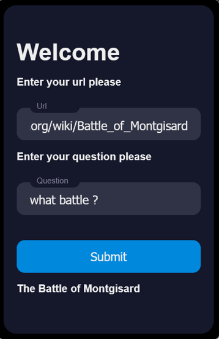
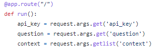
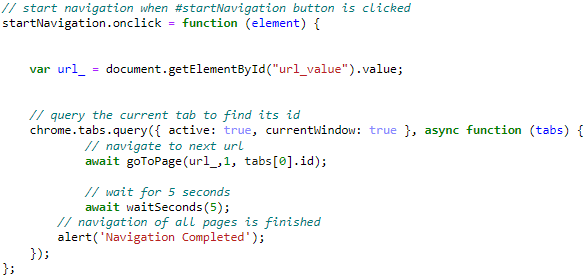
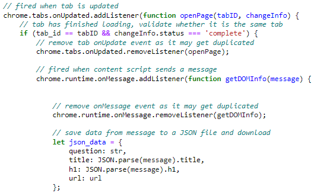
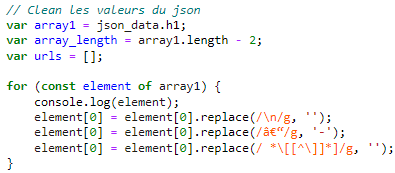
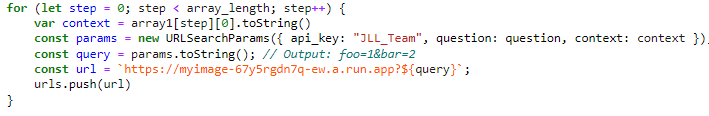
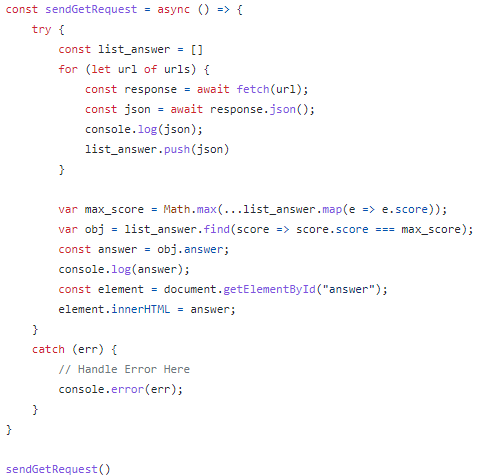

<div id="top"></div>

<!-- PROJECT LOGO -->
<br />
<div align="center">
  <a href="https://github.com/github_username/repo_name">
    
  </a>

<h3 align="center">Wikipedia guesser</h3>

  <p align="center">
    project_description
    <br />
    <a href="https://github.com/esnaultloic/ProjectCloudComputing"><strong>Explore the docs »</strong></a>
    <br />
  </p>
</div>


<!-- TABLE OF CONTENTS -->
<details>
  <summary>Table of Contents</summary>
  <ol>
    <li>
      <a href="#about-the-project">About The Project</a>
      <ul>
        <li><a href="#built-with">Built With</a></li>
      </ul>
    </li>
    <li>
      <a href="#getting-started">Getting Started</a>
      <ul>
        <li><a href="#prerequisites">Prerequisites</a></li>
        <li><a href="#installation">Installation</a></li>
      </ul>
    </li>
    <li><a href="#usage">Usage</a></li>
    <li><a href="#roadmap">Roadmap</a></li>
    <li><a href="#contributing">Contributing</a></li>
    <li><a href="#license">License</a></li>
    <li><a href="#contact">Contact</a></li>
    <li><a href="#acknowledgments">Acknowledgments</a></li>
  </ol>
</details>


<!-- ABOUT THE PROJECT -->
## About The Project



The project consists in creating a firefox and chrome extension to guess answers to question using informations on a wikipedia page.

<p align="right">(<a href="#top">back to top</a>)</p>


### Built With

* JavaScript
* Gcloud
* Docker

<p align="right">(<a href="#top">back to top</a>)</p>


<!-- GETTING STARTED -->
## Getting Started

To install and run this extension locally you have to download the files in the repository.

### Installation

1. Use this API Key "JLL_Team"
2. Clone the repo
   ```sh
   git clone https://github.com/esnaultloic/ProjectCloudComputing.git
   ```
3. Enter your API URL in `popup.js`
   ```js
   const url = `https://myimage-67y5rgdn7q-ew.a.run.app?${query}`;
   ```
4. Enter your API KEY in `popup.js`
   ```js
   const params = new URLSearchParams({ api_key: "JLL_Team", question: question, context: context });
   ```****
<p align="right">(<a href="#top">back to top</a>)</p>


<!-- Code explanation -->
## API explanation

For the API we developed a Flask code to use an online model called roberta-base-squad2.
Firstly we give 3 parameters the API Key, the question which is given by the user and the context which is the list of each paragraph from the wikipedia page.



Then we run the model and if the API key is not "JLL_Team" we call an error otherwise we use it and get a certainty score for each answer.

We take the highest score and return the answer linked to this score.


## Extension explanation

The first part of the extension is to get the Url which is obtained here.


The second part is to get the question from the user.


<p align="right">(<a href="#top">back to top</a>)</p>
The third part is to get the data from the wikipedia page.

After that we clean the data.

Then we call the API to make it learn the content of the page it takes each pargraphe one by one and execute the deep learning model with the question.

The model gives a json with the answer to the question and a certainty score to let us know what's the precision on this question.



<!-- CONTACT -->
## Contact

Your Name - email@email_client.com

Project Link: [https://github.com/esnaultloic/ProjectCloudComputing](https://github.com/esnaultloic/ProjectCloudComputing)

<p align="right">(<a href="#top">back to top</a>)</p>


<p align="right">(<a href="#top">back to top</a>)</p>

