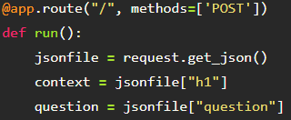
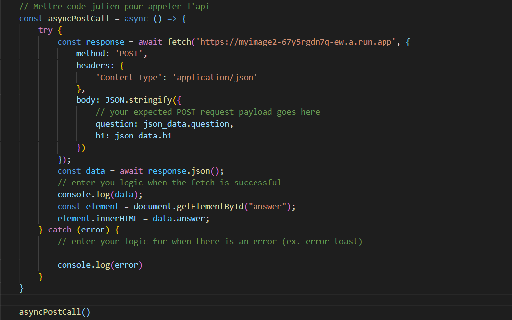
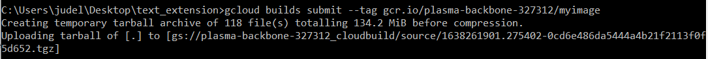
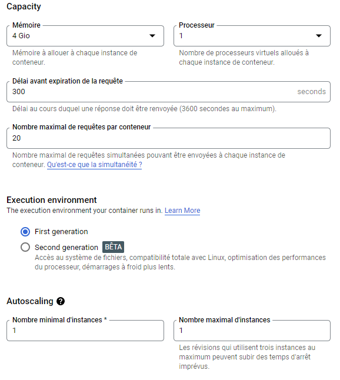
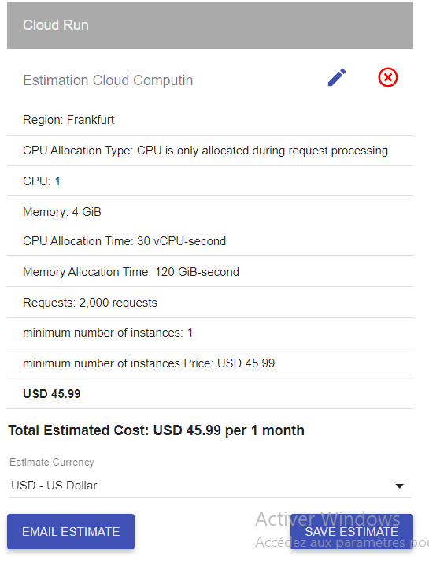

<div id="top"></div>

<!-- PROJECT LOGO -->
<br />
<div align="center">
  <a href="https://github.com/github_username/repo_name">
    
  </a>

<h3 align="center">Wikipedia guesser</h3>

  <p align="center">
    Guessing answers using wikipedia pages
    <br />
    <a href="https://github.com/esnaultloic/ProjectCloudComputing"><strong>Explore the docs</strong></a>
    <br />
  </p>
</div>


<!-- TABLE OF CONTENTS -->
<details>
  <summary>Table of Contents</summary>
  <ol>
    <li>
      <a href="#about-the-project">About The Project</a>
      <ul>
        <li><a href="#built-with">Built With</a></li>
      </ul>
    </li>
    <li>
      <a href="#getting-started">Getting Started</a>
      <ul>
        <li><a href="#installation">Installation</a></li>
      </ul>
    </li>
    <li><a href="#api-explanation">API explanation</a></li>
    <li><a href="#extension-explanation">Extension explanation</a></li>
    <li><a href="#api-creation">API Creation</a></li>
    <li><a href="#cost-estimation">Cost estimation</a></li>
    <li><a href="#contact">Contact</a></li>
    
  </ol>
</details>


<!-- ABOUT THE PROJECT -->
## About The Project


The project consists in creating a firefox and chrome extension to guess answers to question using informations on a wikipedia page.
First the extension scraps the content of a wikipedia page.
Then it runs the deep learning model using the question given by the user.
The API returns the answer with the highest certainty score among the different paragraphs of the wikipedia page.
<p align="right">(<a href="#top">back to top</a>)</p>


### Built With

* JavaScript
* Google cloud
* Docker
* Python
* Flask

<p align="right">(<a href="#top">back to top</a>)</p>

<!-- GETTING STARTED -->
## Getting Started

To install and run this extension locally you have to download the files in the repository.
Model Link: [https://huggingface.co/deepset/roberta-base-squad2](https://huggingface.co/deepset/roberta-base-squad2)

### Installation

1. Use this API Key "JLL_Team"
2. Clone the repo
   ```sh
   git clone https://github.com/esnaultloic/ProjectCloudComputing.git
   ```
3. Enter your API URL in `popup.js`
   ```js
   const url = `https://myimage-67y5rgdn7q-ew.a.run.app?${query}`;
   ```
4. Enter your API KEY in `popup.js`
   ```js
   const params = new URLSearchParams({ api_key: "JLL_Team", question: question, context: context });
   ```
<p align="right">(<a href="#top">back to top</a>)</p>

<!-- CODE EXPLANATION -->
## Api Explanation

We developed the python API using Flask by implementing an online model called roberta-base-squad2. Firstly with a POST method we select the question and the paragraphs from the json file we created thanks to the scraping of the web page



If the question or the context is empty we return an error code. Else, we load the model and loop over the paragraphs. We returned the answer from paragraph that presents the highest certainty score looking at the question. The response returned is in a json format with the index of the paragraph in the page, the answer of the question, the certainty score and the starting and ending index of the answer in the paragraph.


### Extension Explanation

The first part of the extension is to get the Url which is obtained here.


The second part is to get the question from the user.


After that we clean the data.


Then we create different url to call the API only once.


We call the content_script code which makes the interaction between the webpage and the extension.


It creates a message with scrapped data.


The third part is to get the data from the message created in content_script.js.


we call the api and we display the result à la place de We loop through each url to get all the answers and we select the one with the highest score.



<!-- API CREATION -->
## Api Creation
From here the API is usable, the fifth part is needed only if you want to create the API by yourself.
To put the API online we use google cloud and Docker. 
In the dockerfile we precise the python version and the port that will be used on google cloud. We give the packages to be installed given in requirements.txt.


We need to put the API on google cloud now using gcloud build :



<!-- COST ESTIMATION -->
## Cost estimation
Here is the estimated cost with these settings :




<!-- CONTACT -->
## Contact

Your names - delagesjul@cy-tech.fr esnaultloi@cy-tech.fr popalouis@cy-tech.fr

Project Link: [https://github.com/esnaultloic/ProjectCloudComputing](https://github.com/esnaultloic/ProjectCloudComputing)

Model Link: [https://huggingface.co/deepset/roberta-base-squad2](https://huggingface.co/deepset/roberta-base-squad2)

<p align="right">(<a href="#top">back to top</a>)</p>
